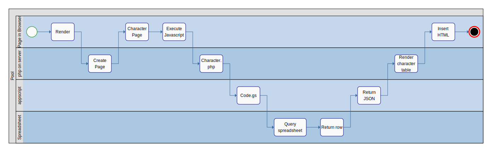

Character Table
===============

- [Character Table](#character-table)
  - [Instructions](#instructions)
- [Context](#context)
- [Decision](#decision)
- [Feature: Character information is managed separate from wordpress](#feature-character-information-is-managed-separate-from-wordpress)
  - [Scenario: Manage character information in a table](#scenario-manage-character-information-in-a-table)
  - [Scenario: Provide character information upon request](#scenario-provide-character-information-upon-request)
- [Feature: Display character information in a table](#feature-display-character-information-in-a-table)
  - [Scenario: Display the character table inside the character's web page](#scenario-display-the-character-table-inside-the-characters-web-page)



## Instructions

To make this work, insert the following code into the wordpress page.

```html
<div class="character-table" name="Freesia"></div>
```

Where `Freesia` is the name of one of the characters in the spreadsheet.

# Context

The character pages on the wordpress site will include a table containing statistics of the character on that page.

# Decision

Insert a table that contains the page's character information.
Provide a way for the character information to be maintained and utilized in other places.

# Feature: Character information is managed separate from wordpress

**In order to** teach people about the book, Mae and the Kingdoms of Seasons  
**As a** content publisher  
**I want to** have a comprehensive database of character information  

## Scenario: Manage character information in a table

**GIVEN** I have character information  
**WHEN** I save information electronically  
**THEN** The character information is stored in a data table  

## Scenario: Provide character information upon request  

**GIVEN** I have character information stored in a data table  
**WHEN** I send a request to get information for a specified character  
**THEN** I receive that character's information  

# Feature: Display character information in a table

**In order to** teach people about the book, Mae and the Kingdoms of Seasons  
**As a** content publisher  
**I want to** display the information in a table inside the character's web page  

## Scenario: Display the character table inside the character's web page

**GIVEN** I have a character web page for character "A"  
**WHEN** I view the character web page  
**THEN** I see a table with the character's data in the page  

